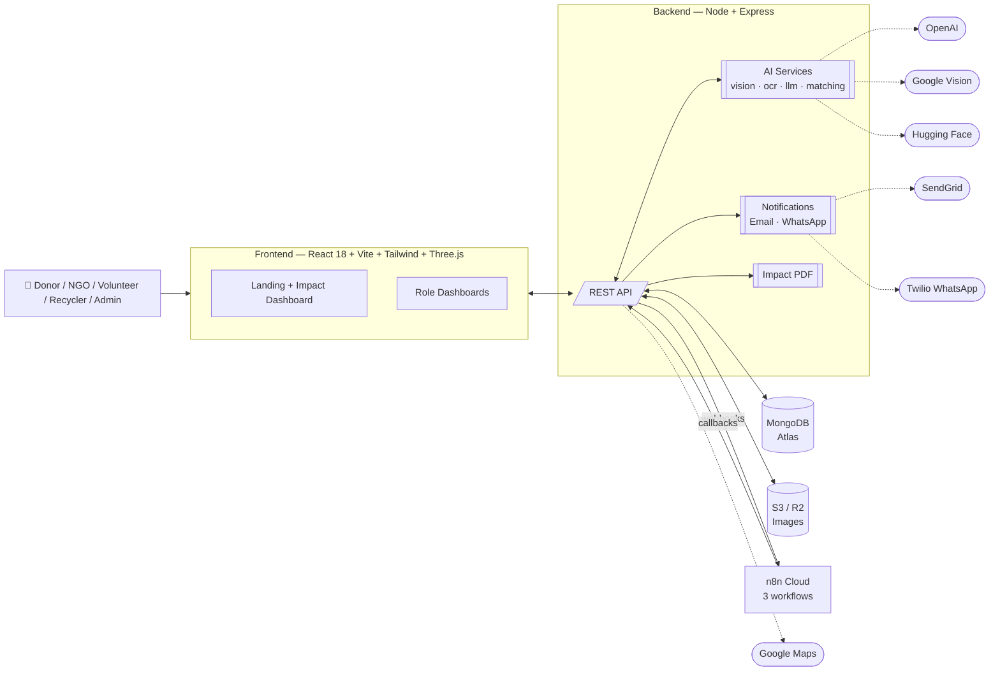
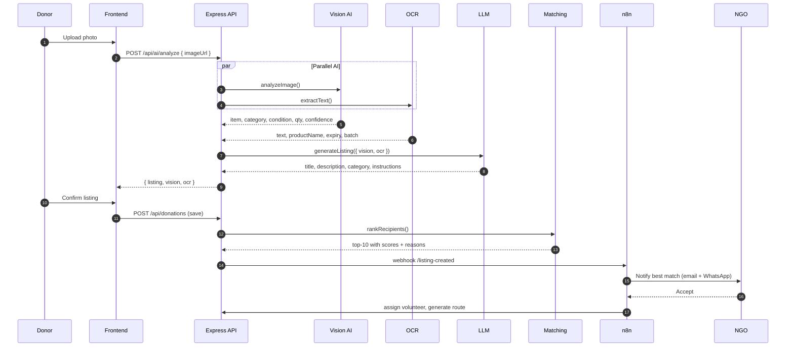
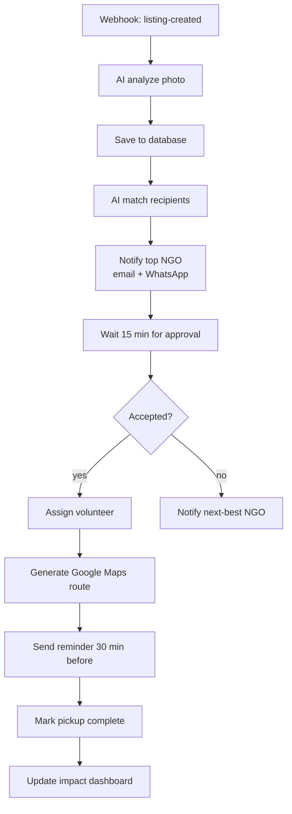
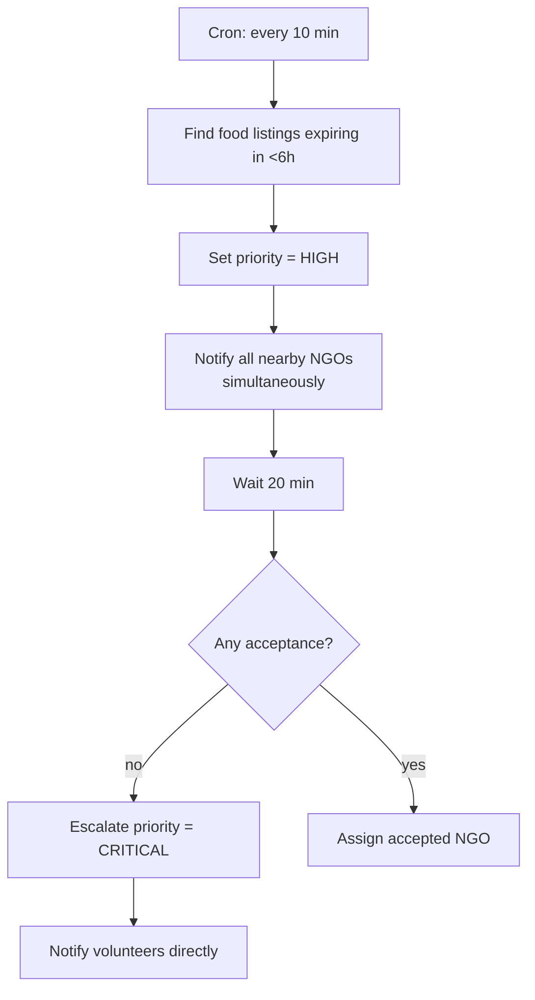
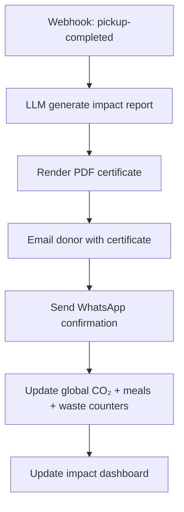
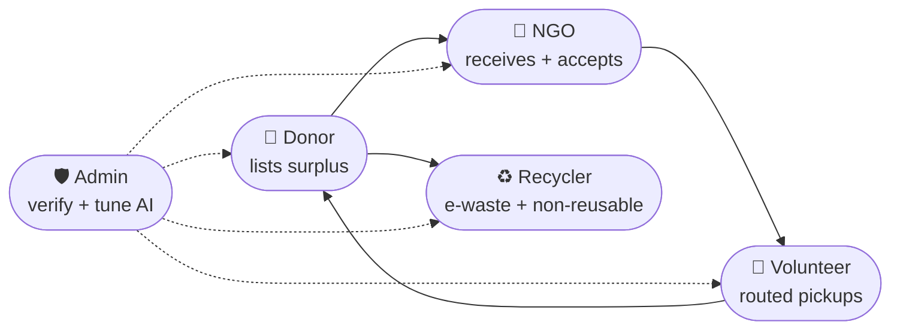

<div align="center">


# ReLoop&nbsp;AI

### AI-Powered Circular Resource Exchange Platform

**Intelligent redistribution of surplus resources through AI automation.**

[](https://react.dev)
[](https://vitejs.dev)
[](https://www.typescriptlang.org)
[](https://nodejs.org)
[](https://tailwindcss.com)
[](https://threejs.org)
[](https://n8n.io)
[](./LICENSE)
[](https://sdgs.un.org/goals/goal12)

</div>

---

> **ReLoop AI** turns any photo of surplus — food, electronics, furniture, books, clothes, medical supplies, or recyclables — into a routed, matched, tracked, and impact-reported pickup. Vision AI + OCR + LLM autogenerate the listing, a weighted scorer matches the best recipient, and three n8n workflows orchestrate approval, dispatch, and post-pickup impact reporting end-to-end.

##  Contents

1. [Highlights](# highlights)
2. [Live experience](# live-experience)
3. [Architecture](# architecture)
4. [AI pipeline](# ai-pipeline)
5. [Automation workflows](# automation-workflows)
6. [Impact model](# impact-model)
7. [Roles](# roles)
8. [Tech stack](# tech-stack)
9. [Quick start](# quick-start)
10. [Deploy](# deploy)
11. [API reference](# api-reference)
12. [Environment variables](# environment-variables)
13. [Project layout](# project-layout)
14. [Roadmap](# roadmap)
15. [License](# license)

---

##  Highlights

| | |
|---|---|
| 🧠 **Vision + OCR + LLM** | One photo becomes a complete listing — title, description, category, condition, quantity, expiry, instructions. |
| 🎯 **Weighted AI matching** | Recipients scored on distance (30%) · urgency (25%) · category fit (20%) · storage (15%) · availability (10%). |
| 🔄 **3 n8n workflows** | Donation lifecycle · Expiry escalation · Impact & receipt — all import-ready JSON. |
| 📊 **Live impact dashboard** | Waste diverted · meals donated · CO₂ saved · pickups · NGOs · volunteers · AI recommendations. |
| 🎭 **Provider-agnostic AI** | Toggle `AI_PROVIDER` between `groq`, `openai`, `huggingface`, or `mock` — boots without a single key. |
| 🌍 **7 resource streams** | Food, Electronics, Furniture, Books, Clothes, Medical, Recyclables — SDG 12 aligned. |
| 👥 **5 roles** | Donor · NGO · Volunteer · Recycler · Admin, each with a tailored dashboard. |
| 📨 **Multi-channel notify** | SendGrid email + Twilio WhatsApp + in-app, fanning out per user preference. |
| 📄 **Impact certificates** | Auto-generated PDF receipt with CO₂ saved + meals + waste diverted. |

##  Live experience

The landing page pairs a **real-time Three.js scene** (distorted icosahedron core, orbiting torus knot, sparkles, city environment reflections) with:

- Mouse-follow radial cursor glow (mix-blend-screen)
- Animated ambient gradient blobs (violet → blue → teal)
- Magnetic buttons with 3D tilt-on-hover
- Holographic tilt cards for the 7 category tiles
- Scroll-progress beam pinned to the viewport top
- Scan-line animation over the AI detection mock
- Framer Motion scroll-triggered stagger reveals throughout

Every motion respects `prefers-reduced-motion`.

##  Architecture



##  AI pipeline

Sequence for a new listing, from photo upload to dispatch:



**Weighted scoring formula:**

```
score = 0.30 · distance   + 0.25 · urgency
      + 0.20 · category   + 0.15 · storage
      + 0.10 · availability
```

Each component is a 0–100 sub-score. `urgency` accelerates non-linearly for food inside a 6h window; `distance` uses haversine on `pickupCoords` ↔ `recipient.coords`.

##  Automation workflows

All three are importable JSON in [`Automation/n8n/`](./Automation/n8n).

### Workflow 1 — Donation lifecycle



### Workflow 2 — Expiry escalation



### Workflow 3 — Impact & receipt



##  Impact model

Deterministic baseline (used by mock provider and to backfill LLM output):

| Category | CO₂ factor (kg/kg) | Meals factor |
|---|---:|---:|
| Food | 2.5 | 2.4 |
| Electronics | 12 | 0 |
| Furniture | 3.5 | 0 |
| Books | 1.2 | 0 |
| Clothes | 6 | 0 |
| Medical | 4 | 0 |
| Recyclables | 1.5 | 0 |

Example generated summary:
> *"This donation saved approximately 12 meals, prevented ≈18 kg of CO₂ emissions, and diverted 8 kg of food waste from landfills."*

##  Roles



##  Tech stack

| Layer | Technology |
|---|---|
| Frontend | React 18 · TypeScript 5.6 · Vite 6 · Tailwind 3 · shadcn/ui · Framer Motion 12 · **Three.js r169 + @react-three/fiber + @react-three/drei** · Recharts · React Router 7 |
| Backend | Node 20 · Express 4 · Mongoose 8 · Axios · JWT · bcrypt · SendGrid · AWS S3 SDK |
| AI | Groq (Llama 3.2 Vision + Llama 3.3 Text) · OpenAI (GPT-4o Vision + text) · Google Cloud Vision · Hugging Face ViT · provider-agnostic with mock fallback |
| Automation | n8n — 3 importable workflows |
| Data | MongoDB Atlas · S3-compatible object storage (R2 / S3 / MinIO) |
| Notifications | SendGrid · Twilio WhatsApp |
| Deploy | Vercel (frontend) · Render / Railway / Fly (backend) · n8n Cloud |

##  Quick start

```bash
git clone https://github.com/<you>/reloop-ai.git
cd reloop-ai
./setup.sh                # installs both apps, copies .env.example → .env

# Terminal 1 — backend (mock AI, zero keys needed)
cd Backend && npm run dev             # http://localhost:5000

# Terminal 2 — frontend
cd Frontend && npm run dev            # http://localhost:5173
```

That's it. The app is fully browsable in demo mode. Set `AI_PROVIDER=groq` + `GROQ_API_KEY` in `Backend/.env` to switch to real inference.

##  Deploy

Full step-by-step in [`Docs/DEPLOYMENT.md`](./Docs/DEPLOYMENT.md). Quick version:

| Service | Where | Notes |
|---|---|---|
| Frontend | Vercel — import repo, Root Directory `Frontend` | Set `VITE_Backend_URL` = backend URL |
| Backend | Render — “New Blueprint”, picks up `render.yaml` | Provisions env + healthcheck automatically |
| Database | MongoDB Atlas (free tier) | Paste `MONGO_URI` into Render |
| Automation | n8n Cloud | Import 3 JSONs from `Automation/n8n/` |
| Images | S3 / R2 / MinIO | Fill the 5 `S3_*` env vars |

A `Backend/Dockerfile` is also included for Fly.io / Railway / Cloud Run. GitHub Actions in `.github/workflows/ci.yml` builds the frontend and smoke-tests the backend on every push.

##  API reference

| Method | Path | Purpose |
|---|---|---|
| `POST` | `/api/ai/analyze` | Vision + OCR + LLM combined — returns full listing draft |
| `POST` | `/api/ai/match` | Rank recipients for a saved listing |
| `POST` | `/api/ai/impact` | Generate impact report for a completed listing |
| `POST` | `/api/webhooks/listing-created` | Kicks off n8n Workflow 1 |
| `POST` | `/api/webhooks/expiry-escalation` | Kicks off n8n Workflow 2 |
| `POST` | `/api/webhooks/pickup-completed` | Kicks off n8n Workflow 3 |
| `GET`  | `/api/nearby-places` | Google Maps proxy (uses server-side key) |
| `GET`  | `/api/health` | Liveness for Render / Fly / Cloud Run |

All AI endpoints degrade gracefully to `mock` when providers or keys are absent — the app never crashes on missing configuration.

##  Environment variables

<details>
<summary><b>Frontend</b> — <code>Frontend/.env</code></summary>

```env
VITE_Backend_URL=http://localhost:5000
```
</details>

<details>
<summary><b>Backend</b> — <code>Backend/.env</code></summary>

```env
# Core
PORT=5000
CORS_ORIGINS=http://localhost:5173
MONGO_URI=mongodb+srv://…
JWT_SECRET=change-me

# Storage
S3_ENDPOINT=
S3_ACCESS_KEY=
S3_SECRET_KEY=
S3_BUCKET=
S3_PUBLIC_BASE=

# Maps (server-side only — never expose to browser)
GOOGLE_MAPS_API_KEY=

# AI providers  (mock | groq | openai | huggingface)
AI_PROVIDER=mock
OPENAI_API_KEY=
OPENAI_VISION_MODEL=gpt-4o-mini
OPENAI_TEXT_MODEL=gpt-4o-mini
HF_TOKEN=
HF_VISION_MODEL=google/vit-base-patch16-224

# Groq API Configuration
GROQ_API_KEY=
GROQ_VISION_MODEL=llama-3.2-11b-vision-preview
GROQ_TEXT_MODEL=llama-3.3-70b-versatile

# OCR (mock | groq | openai | google)
OCR_PROVIDER=mock
GOOGLE_VISION_KEY=

# Notifications
SENDGRID_API_KEY=
EMAIL_FROM=noreply@yourdomain.com
TWILIO_ACCOUNT_SID=
TWILIO_AUTH_TOKEN=
TWILIO_WHATSAPP_FROM=

# n8n
N8N_WEBHOOK_BASE=https://your-workspace.n8n.cloud/webhook
N8N_SECRET=share-with-n8n

# Public URLs (used by PDF + email links)
PUBLIC_APP_URL=https://reloop.ai
PUBLIC_ASSET_BASE=https://cdn.reloop.ai
```
</details>

##  Project layout

```
reloop-ai/
├─ Frontend/                     # React + Vite + TS + Three.js
│  ├─ src/
│  │  ├─ components/
│  │  │  ├─ fx/               # Scene3D, CursorGlow, TiltCard,
│  │  │  │                    #   MagneticButton, GradientBlobs,
│  │  │  │                    #   ScrollProgress, Reveal, Marquee,
│  │  │  │                    #   AnimatedCounter
│  │  │  ├─ brand/            # Logo, brand tokens
│  │  │  └─ LandingPage/      # Hero, FeatureSection, Automation, FAQ
│  │  ├─ Dashboard/            # Impact + role dashboards
│  │  └─ Pages/                # Landing, Login, role home pages
│  ├─ vercel.json               # Vercel deploy config
│  └─ package.json
├─ Backend/                      # Node + Express + Mongoose
│  ├─ ai/                       # vision.js  ocr.js  llm.js  matching.js
│  ├─ routes/                   # ai.js  webhooks.js  auth.js  donation.js …
│  ├─ services/                 # notifications.js  impactPdf.js
│  ├─ models/                   # Donation, User, Notification, …
│  ├─ Dockerfile
│  └─ .env.example
├─ Automation/
│  └─ n8n/                      # 3 importable workflow JSONs
├─ Docs/
│  ├─ ARCHITECTURE.md
│  ├─ DEPLOYMENT.md
│  └─ ROADMAP.md
├─ .github/workflows/ci.yml      # Build + smoke-test on every push
├─ render.yaml                   # One-click Render blueprint
├─ setup.sh                      # One-shot local bootstrap
└─ README.md
```

##  Roadmap

See [`Docs/ROADMAP.md`](./Docs/ROADMAP.md) for the full plan, including the **FastAPI + Supabase migration path** documented in the original architecture brief. Highlights:

- Swap Express → FastAPI (routes are already narrow — straight 1:1 port)
- Swap MongoDB → Supabase Postgres + Row-Level Security
- Real PDF certificate rendering (`pdfkit` or Puppeteer)
- Fine-tuned domain LLM for category-specific instructions
- On-device Vision AI for offline volunteer app
- Public impact leaderboard

##  License

MIT — see [`LICENSE`](./LICENSE).

---

<div align="center">

**Built with intention. Automated by AI. Aligned to SDG 12.**

<sub>ReLoop AI · The circular economy, automated.</sub>

</div>
